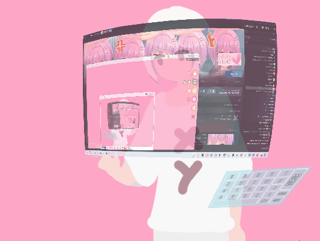
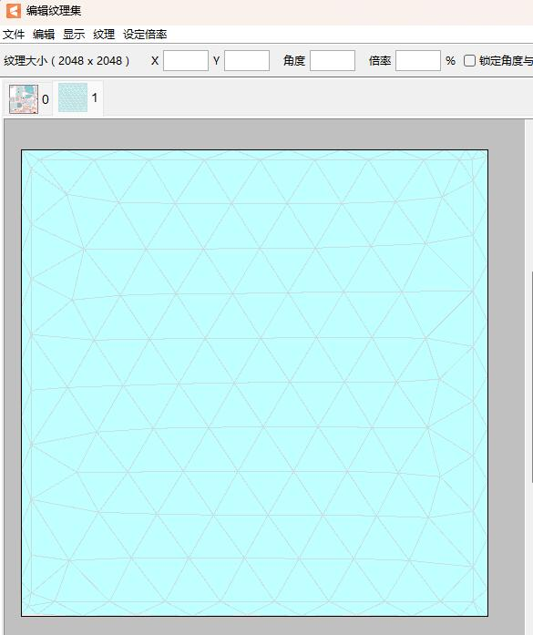

# VTS_NDIToArtMesh
一个用于VTubeStudio的插件，将NDI数据传输到模型的ArtMesh上。

A plug-in for VTubeStudio, transfer NDI data to the ArtMesh of the model.

[EnglishReadme][7]

## 预览


## 如何安装和使用
视频教程 [bilibili][6]
### ①
如果你已经安装了VTS_XYPlugin`2.4.0`以上版本，则跳转到③，如果你安装了VTS_XYPlugin但是版本不到2.4.0，则必须先更新再跳转到③，如果你不希望安装VTS_XYPlugin，则直接看②

### ②
下载并安装[BepInEx_UnityMono_x64_6.0.0-pre.1][1] 

### ③
下载VTS_NDIToArtMesh[最新版本][2]，将压缩包内的VTS_NDIToArtMesh.dll解压到VTube Studio\BepInEx\plugins文件夹(如果没有则新建)

### ④
打开模型文件夹(.moc3文件所在的文件夹)，创建配置文件，文件名为 `模型名.NDIToArtMesh.json`，例如你的模型为`cat.moc3`，则配置文件名为`cat.NDIToArtMesh.json`

将下面的代码复制到配置文件中，根据你的需求修改参数并保存。

```json
{
  "NDIName": "XYMAINPC (NVIDIA GeForce RTX 4090 1)",
  "HorizontalFlip": true,
  "VerticalFlip": false,
  "ArtMeshNames": [
    "Square2048"
  ]
}
```

`NDIName` 表示用于NDI通信的名称，这个名称需要从NDI发送端获取。

`HorizontalFlip` 表示是否需要对画面进行水平翻转，如果你需要画面面向你的角色而不是面向观众，这会很方便。

`VerticalFlip` 表示是否需要对画面进行竖直翻转。

`ArtMeshNames` 是目标ArtMesh的名字列表。如果你需要将画面渲染到多个ArtMesh上，例如你想做屏幕在眼睛中的反光，你可以按照如下格式填写。

```json
{
  "NDIName": "XYMAINPC (NVIDIA GeForce RTX 4090 1)",
  "HorizontalFlip": true,
  "VerticalFlip": false,
  "ArtMeshNames": [
    "Square2048",
    "ArtMesh1",
    "ArtMesh2"
  ]
}
```
### ⑤
启动VTS

## 如何让一个模型接收多个不同的NDI源
如果你的模型上不止有一个区域需要显示内容，只需要将配置文件复制多份，以`模型名.*.NDIToArtMesh.json`的方式命名(*代表任意合法字符)，在每个配置文件中填入不同的NDI名字即可。


## 如何捕获屏幕并发送NDI数据
你可以使用OBS或NDITools，如果是单纯捕获屏幕，我这里推荐使用NDITools。

### ①
下载并安装[NDITools][3]

### ②
在NDITools中打开`Screen Capture`，它会立即开始输出屏幕的NDI信号。

### ③
在NDITools中打开`Studio Monitor`，在这里可以查看所有NDI信号的画面和名字，将需要的画面的名字填入VTS_NDIToArtMesh配置文件。看完名字后，可以关闭Studio Monitor。

## 如何捕获特定窗口，如绘画软件
我使用的是OBS，所以在这里我会讲解如何通过OBS发送NDI信号。

### ①
下载并安装[OBS][4]，我使用的是29版本，28版本也是可以的。

### ②
为OBS安装[OBS-NDI][5]插件。

### ③
在OBS中添加窗口捕获或者游戏源等等等，并在顶部的`工具->NDI输出设置`中勾选开启主输出。

### ④
为了知道NDI名称，我们可以在OBS中创建一个NDI来源，在来源名称的下拉选单中，可以看到NDI名称，复制此名称并填入VTS_NDIToArtMesh配置文件。看完名字后，可以删除这个临时的NDI来源。

## 我的OBS中设置的是直播画面，我不想将其他的UI和立绘等画面传入VTS怎么办
由于OBS的NDI输出会输出最终合成的画面，所以如果需要单独的画面，可以双开OBS。

对于第一个OBS，我们保持正常的直播配置，此OBS可以不开启NDI。

对于第二个OBS，我们单独采集需要的画面并开启NDI。

由于只能同时捕获一个游戏源，因此对于两边都需要画面的情况。可以在第二个OBS捕获游戏源，之后通过NDI将其发送到第一个OBS，而不是以其他方式绕过。

## 对于Live2D模型师，应该如何正确制作一个屏幕
为了完整的显示NDI画面，用于制作屏幕的图片应该单独存放在一个图集中。

屏幕的图片应该是正方形的，不应该是画师根据透视画出来的形状，形状应该在Live2D Cubism Editor中进行变形。



我准备了一个预先做好的纯白方形图片`Square2048.png`，可以直接下载使用此图片。

屏幕的布点，不应该是点围绕着屏幕，点应该紧贴着屏幕边缘，如果点超出了屏幕边缘，在VTS中你会看到超出的部分都会被同一颜色填充。


## 除了显示屏幕，还可以用来做什么的吗
只要是可以传输NDI的画面都可以传入VTS，发挥你的想象。

比如在模型中显示观众的弹幕，显示歌词，显示摄像头画面，或者是将AE特效之类的显示到衣服上等等！

## 这个插件对于电脑的资源占用情况如何
根据测试，如果使用1个OBS(1080P 60FPS)直播，外加4个OBS(1080P 60FPS)作为NDI传输，再加上一个VTS，一共占用了13700K的60%左右性能，这是不可接受的巨大消耗。

但是，当测试条件变成1个OBS(1080P 60FPS)直播，外加3个OBS(640x360 30FPS)作为NDI输出后，再加上一个VTS，占用了13700K的10%左右。

因为模型上面显示的画面并不需要很清晰，所以如果你的电脑不够强，可以通过降低NDI输出的分辨率和帧率来达到优化的目的。

## 反馈
如果你有更好的NDI工具，可以告诉我，我对直播工具了解的并不算多。

如果有人制作了其他语言版本的教程，可以告诉我，我会看情况将链接添加到Readme。


[1]: https://github.com/BepInEx/BepInEx/releases/tag/v6.0.0-pre.1
[2]: https://github.com/xiaoye97/VTS_NDIToArtMesh/releases/latest
[3]: https://ndi.tv/tools/#download-tools
[4]: https://obsproject.com/
[5]: https://github.com/Palakis/obs-ndi/releases
[6]: https://www.bilibili.com/video/BV1HG4y1Q75N
[7]: README_EN.md