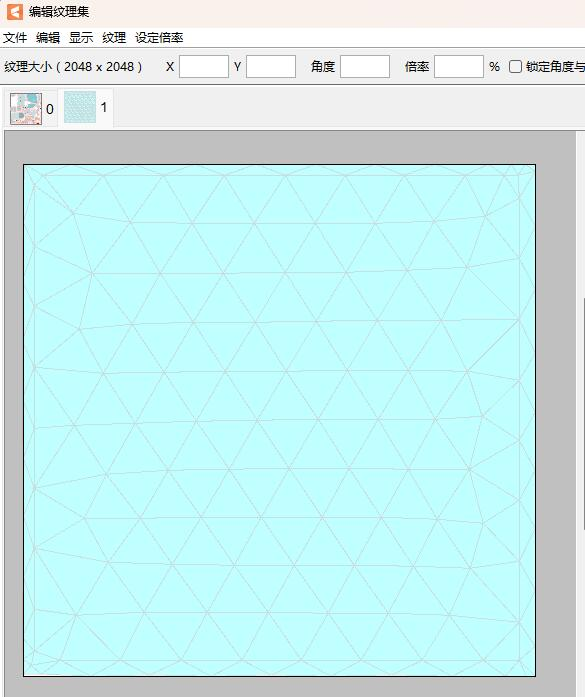
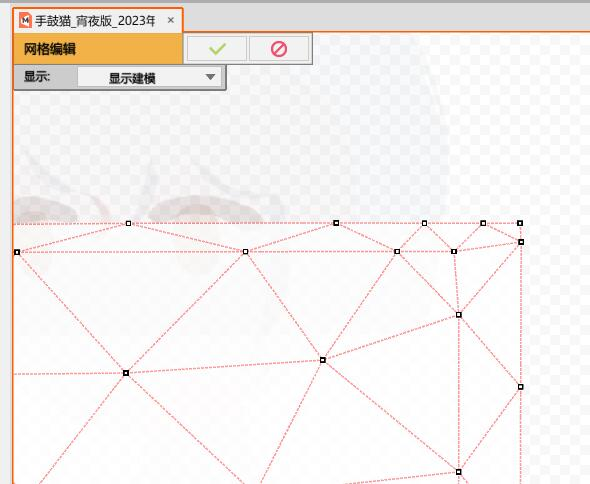

# VTS_NDIToArtMesh
A plug-in for VTubeStudio, transfer NDI data to the ArtMesh of the model.

[中文说明][7]

## Preview


## How to install and use
Video Tutorial (Chinese) [bilibili][6]

`If someone has done a complete English tutorial (text or video), please contact me and I will add it here according to the situation.`
### ①
If you have installed VTS_ XYPlugin `2.4.0` or above, then jump to ③, if you install VTS_ XYPlugin, but the version is less than 2.4.0, You must update it first and then jump to ③, if you don't need VTS_ XYPlugin (because this plug-in is designed for Chinese video platforms), jump to ②

### ②
Download and install [BepInEx_UnityMono_x64_6.0.0-pre.1][1] 

### ③
Download VTS_NDIToArtMesh [latest][2], Extract the VTS_NDIToArtMesh.dll file in the compressed package to the VTube Studio\BepInEx\plugins folder(If not, create a new one)

### ④
Open model folder(The folder where the. moc3 file is located), create a new text file, The file name is `ModelName.NDIToArtMesh.json`. For example, if your model is `cat.moc3`, the configuration file name is `cat.NDIToArtMesh.json`

Copy the following code into the configuration file, modify the parameters according to your requirements and save it.

```json
{
  "NDIName": "XYMAINPC (NVIDIA GeForce RTX 4090 1)",
  "HorizontalFlip": true,
  "VerticalFlip": false,
  "ArtMeshNames": [
    "Square2048"
  ]
}
```

`NDIName` Indicates the name used for NDI communication. This name needs to be obtained from the NDI sender.

`HorizontalFlip` Indicates whether it is necessary to turn the picture horizontally. If you want the picture to face your character rather than the audience, it will be very convenient.

`VerticalFlip` Indicates whether the picture needs to be vertically flipped.

`ArtMeshNames` Is the name list of the target ArtMesh. If you need to render the picture to multiple ArtMesh, for example, if you want to do the reflection of the screen in the eyes, you can fill in the following format.

```json
{
  "NDIName": "XYMAINPC (NVIDIA GeForce RTX 4090 1)",
  "HorizontalFlip": true,
  "VerticalFlip": false,
  "ArtMeshNames": [
    "Square2048",
    "ArtMesh1",
    "ArtMesh2"
  ]
}
```
### ⑤
Start VTS

## How to make a model receive multiple different NDI sources
If there is more than one area on your model that needs to be displayed， You only need to copy multiple copies of the configuration file， named `ModelName.*.NDIToArtMesh.json`(*Represents any character that conforms to the specification), Fill in different NDI names in each configuration file.


## How to capture screen and send NDI data
You can use OBS or NDITools. If you want to capture the screen only, I recommend NDITools here.

### ①
Download and install [NDITools][3]

### ②
在NDITools中打开`Screen Capture`, It will immediately start to output the NDI signal of the screen.

### ③
Open `Studio Monitor` in NDITools, Here you can view the pictures and names of all NDI signals(On the title), Fill the name of the desired screen in VTS_NDIToArtMesh Profile. Then you can close Studio Monitor.

## How to capture specific windows, such as painting software and games
I use OBS, so here I will explain how to send NDI signals through OBS.

### ①
Download and install [OBS][4], I use version 29, and version 28 is also OK.

### ②
Install [OBS-NDI][5] for OBS.

### ③
Add window capture or game source in OBS, And check the `Tools -> NDI Output Settings` at the top to enable the `Main Output`.

### ④
To know the NDI name, we can create an NDI source in OBS. In the drop-down menu of the source name, you can see the NDI name, copy the name and fill in VTS_NDIToArtMesh profile. After reading the name, you can delete the temporary NDI source.

## My OBS is set with live video. What if I don't want to transfer other content to VTS
Because the NDI output of the OBS will output the final composite picture, if you need a separate picture, you can double open the OBS.

For the first OBS, we maintain the normal live broadcast configuration, and this OBS can not enable NDI.

For the second OBS, we separately collect the required images and enable NDI.

Because only one game source can be captured at the same time, it is necessary to capture pictures on both sides. You can capture the game source in the second OBS, and then send it to the first OBS through NDI instead of bypassing it in other ways.

## For Live2D modellers, how to make a screen correctly
In order to display the NDI picture completely, the pictures used to make the screen should be stored separately in a picture set.

The screen image should be square, not the shape drawn by the painter according to perspective, and the shape should be deformed in Live2D Cubism Editor.



I prepared a pure white square image `Square2048.png`, which can be downloaded directly.

The mesh of the screen should not be a point around the screen. The point should coincide with the screen edge. If the point exceeds the screen edge, you will see that the exceeding part will be filled with the same color in VTS.



## What else can I do besides display screen
Any picture that can transmit NDI can be transferred to VTS to give full play to your imagination.

For example, show the audience's bullet screen in the model, show the lyrics, display the camera image, or display the AE special effects on the clothes and so on!

## What is the resource usage of this plug-in for the computer
According to the test, if one OBS (1080P 60FPS) live broadcast is used, plus four OBS (1080P 60FPS) as NDI transmission, plus one VTS, the total performance of 13700K is about 60%, which is unacceptable huge consumption.
However, when the test condition becomes one OBS (1080P 60FPS) live broadcast, plus three OBS (640x360 30FPS) as NDI output, plus one VTS, it takes up about 10% of 13700K.
Because the picture shown on the model does not need to be very high definition, if your computer performance is not strong enough, you can optimize it by reducing the resolution and frame rate of NDI output.

## Feedback
If you have better NDI tools, you can tell me that I don't know much about live broadcast tools.

If someone has done a complete English tutorial (text or video), please contact me and I will add it here according to the situation.

[1]: https://github.com/BepInEx/BepInEx/releases/tag/v6.0.0-pre.1
[2]: https://github.com/xiaoye97/VTS_NDIToArtMesh/releases/latest
[3]: https://ndi.tv/tools/#download-tools
[4]: https://obsproject.com/
[5]: https://github.com/Palakis/obs-ndi/releases
[6]: https://www.bilibili.com/video/BV1HG4y1Q75N
[7]: README.md